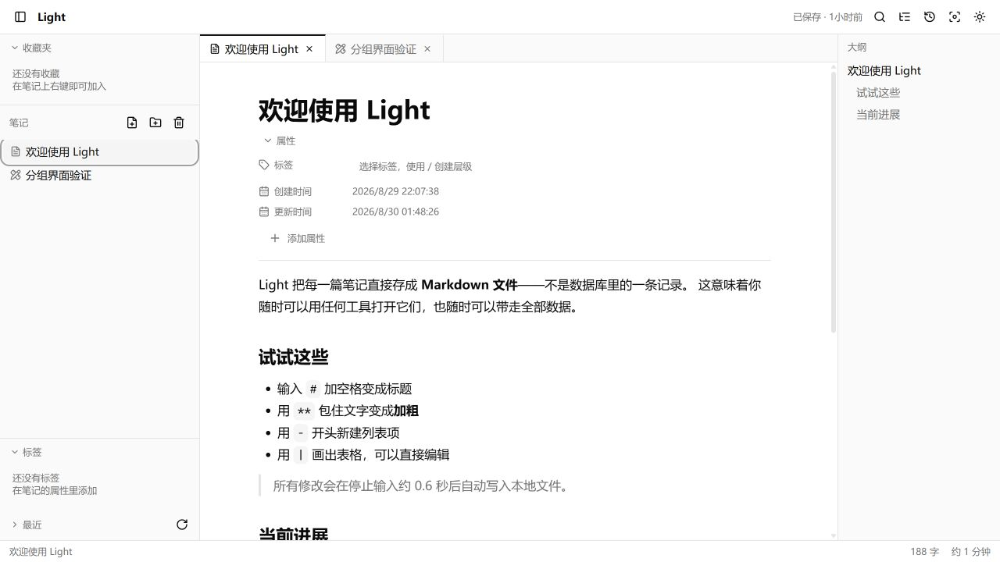
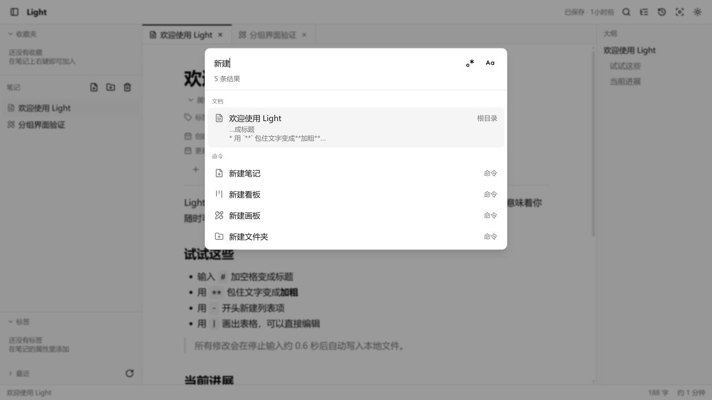
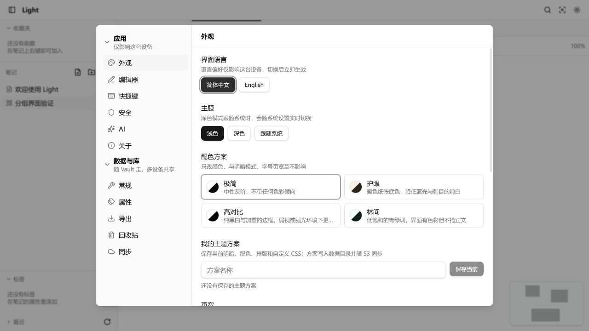

<div align="center">

# Light

**A lightweight, local-first knowledge base for notes, boards, and visual thinking.**

[简体中文](./README.zh-CN.md) · English

[](https://github.com/Okysu/light/releases)
[](https://github.com/Okysu/light/actions/workflows/release.yml)
[](https://v2.tauri.app/)
[](https://vuejs.org/)

</div>



Light keeps knowledge portable. A note is a normal Markdown file on disk, not a row hidden inside a proprietary database. The desktop app works directly with a folder you choose; the web app stores data offline in the browser and can be installed as a PWA.

## Why Light?

- **Local first** — editing and saving never depend on a server or an internet connection.
- **Lightweight by design** — fast startup, focused UI, and no mandatory cloud account.
- **Portable data** — Markdown, readable frontmatter, relative attachment links, and full-vault export.
- **Optional encrypted sync** — connect your own S3-compatible bucket; contents, paths, and manifests are encrypted before upload.
- **One workspace, several ways to think** — notes, Kanban boards, whiteboards, backlinks, and a knowledge graph live together.

## Highlights

| | |
| --- | --- |
|  |  |

- WYSIWYG Markdown editing powered by Milkdown, with CommonMark, GFM, syntax-highlighted code, math, Mermaid, footnotes, highlights, audio, video, tables, and slash commands.
- Obsidian-style `[[wikilinks]]`, anchor and alias support, autocomplete, automatic link updates after renaming, backlinks, and a whole-vault knowledge graph.
- Kanban boards with drag and drop, tags, deadlines, priorities, checklists, assignees, linked notes, filtering, and archiving.
- Infinite canvas with shapes, arrows, freehand drawing, embedded notes and board cards, grouping, minimap, and PNG/SVG export.
- Full-text Chinese-aware search, regular expressions, highlights, and a unified command palette (`Ctrl/⌘ + K`).
- Attachment import by paste, drop, or slash command; reference tracking, orphan cleanup, and optional image OCR.
- Markdown archive, PDF, and offline static-site export.
- OpenAI, Anthropic, and OpenAI-compatible AI providers with locally encrypted API keys, streaming output, selection actions, and BYOK configuration.
- Application lock, sensitive-note encryption, version history, trash, daily notes, theme presets, custom CSS, and configurable shortcuts.

## Platforms

### Web / PWA

Deploy the static web build to Vercel with one click:

[](https://vercel.com/new/clone?repository-url=https://github.com/Okysu/light)

The Vercel build uses `pnpm build`, serves `dist/`, and includes the SPA fallback required for direct navigation.

### Desktop

Windows, macOS, and Linux artifacts are produced from release tags. Download the latest build from [GitHub Releases](https://github.com/Okysu/light/releases).

The desktop client adds local-folder workspaces, a native tray, a global quick-capture shortcut, a platform-aware title bar, and single-instance protection.

> Release-candidate builds are currently unsigned. Your operating system may show a first-launch security warning.

## S3 encrypted sync

Light connects directly from your device to AWS S3, MinIO, Cloudflare R2, or another S3-compatible endpoint. It does not proxy data through a Light server.

- AES-256-GCM encryption for file contents, paths, and manifests.
- Argon2id password derivation plus an offline recovery key.
- Bidirectional incremental sync, deletion propagation, offline recovery, conflict policies, and CAS retries.
- Framed streaming encryption and resumable multipart upload for large attachments.
- Credentials stay encrypted on the local device and are never written into the synced vault.

## Development

Requirements: Node.js 22+, pnpm 10+, and the [Tauri prerequisites](https://v2.tauri.app/start/prerequisites/) for desktop development.

```bash
pnpm install
pnpm dev
```

| Command | Purpose |
| --- | --- |
| `pnpm dev` | Start the web development server |
| `pnpm tauri dev` | Start the desktop client in development mode |
| `pnpm build` | Build the Web/PWA application |
| `pnpm tauri build` | Build desktop bundles for the current platform |
| `pnpm test` | Run the test suite |
| `pnpm typecheck` | Run Vue and TypeScript checks |

## Data location

- **Desktop:** the folder selected by the user.
- **Web:** browser-private OPFS storage. Use export or encrypted S3 sync for backup and portability.

Unknown frontmatter fields are preserved, so files remain friendly to other Markdown tools.

## Releases

`package.json` is the single source of truth for the user-facing and Tauri bundle version. A semantic-version tag such as `0.0.1-rc` triggers tests and native builds for Windows, Linux, macOS Apple Silicon, and macOS Intel, then publishes the artifacts to GitHub Releases.

